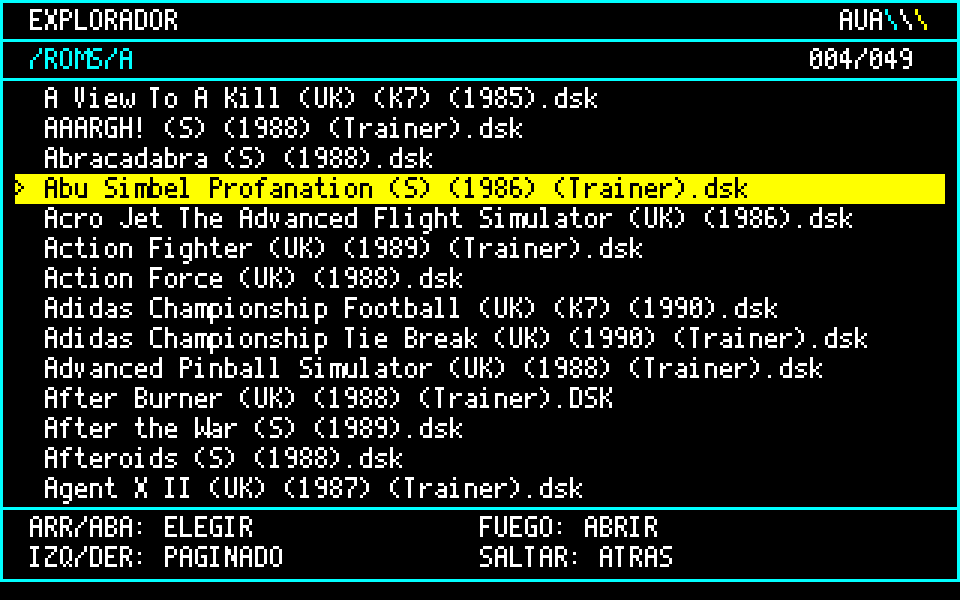
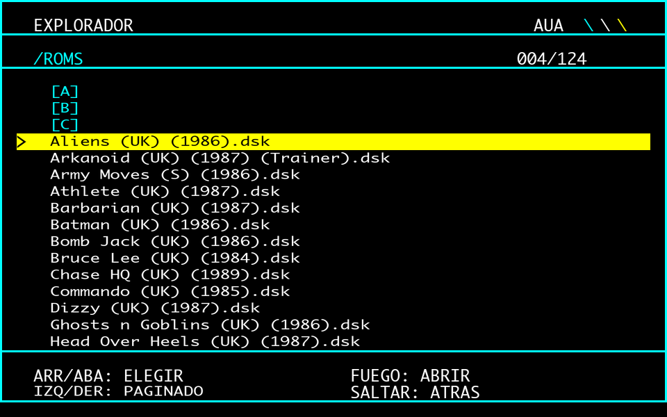
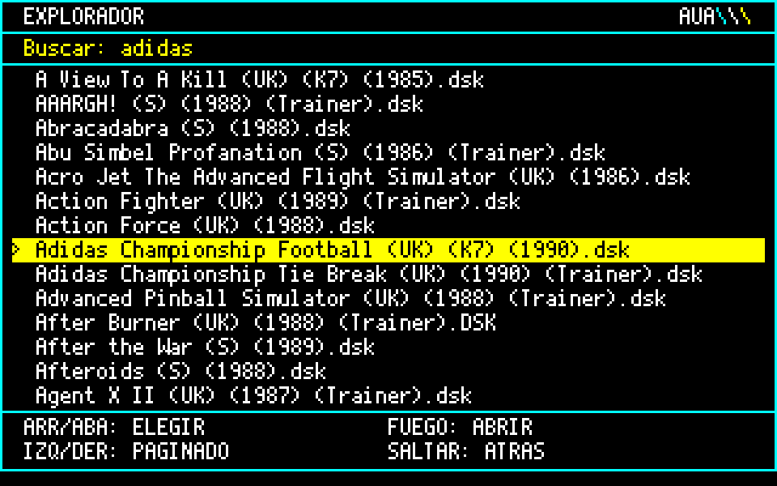

# Explorador Amstrad CPC

por Raul Jimenez · licencia MIT

Explorador de ficheros en ROM para el **M4 Board**. Navega la microSD con
joystick, muestra los nombres de fichero completos y **arranca los juegos
directamente** al pulsar fuego sobre una imagen `.dsk`.



*La v2 listando una carpeta. Captura generada con la misma fuente y la
misma maquetación que usa la ROM.*

## Por qué existe

M4FE, el front-end habitual del M4, muestra los nombres mutilados
—`ALIENS~2.DSK`— porque en Mode 1 solo le caben unos 13 caracteres por
línea: gasta un panel lateral fijo en la ayuda y le queda poco sitio.

Este explorador mueve la ayuda al pie de pantalla y aprovecha el ancho
entero para el nombre. Con el mismo hardware.

## Dos versiones

Hay dos ROMs. Se instalan igual, se manejan igual y usan los mismos
ficheros BASIC; cambia cómo pintan la pantalla. **Instala solo una**:
las dos se llaman con `|EXPLOR`.

| | M4FE | v1 | v2 |
|---|---|---|---|
| Modo | Mode 1, 40 col | Mode 1, 40 col | Mode 1, **64 col** |
| Fuente | la del sistema | la del sistema | propia, 5×10 píxeles |
| Nombre visible | ~13 caracteres | 37 caracteres | **58 caracteres** |
| Juegos por página | — | 16 | 14 |
| Colores | 4 | 4 | 4, los mismos que la v1 |
| ROM | — | [`EXPLOR1.ROM`](build/EXPLOR1.ROM) (v1.1) | [`EXPLOR2.ROM`](build/EXPLOR2.ROM) (v2.1) |

**Cuál elegir.** La v2, salvo que prefieras la letra del sistema: enseña
58 caracteres de cada nombre frente a los 37 de la v1, y los nombres de
las colecciones de juegos suelen ser largos (título, país, año, editor…).
Los que no caben terminan en `..`.

### v1: la letra del sistema

Mode 1 a 40 columnas con la fuente de la ROM del CPC, que es la más
nítida. Cada carácter ocupa dos bytes de pantalla.



### v2: 64 columnas con los colores de la v1

La idea de partida era pasar a Mode 2, que tiene 80 columnas, sin
perder el color: Mode 2 solo tiene dos tintas, y conseguir más obliga a
reescribir la paleta mientras el haz baja por la pantalla. Funciona,
pero solo mientras el programa está parado; cada vez que redibuja o lee
la tarjeta, los colores saltan.

La v2 se queda en **Mode 1** y gana columnas por la letra: una fuente
propia de 4 píxeles de ancho más uno de separación, con interlineado y
descendentes de verdad. Los 4 colores son los de la v1, sin trucos de
temporización, así que no hay nada que pueda parpadear.

Por dentro:

- **Letras que no encajan en bytes.** En Mode 1 un byte son 4 píxeles y
  una letra de la v2 ocupa 5, así que casi siempre comparte byte con la
  vecina. Los glifos se guardan ya desplazados en sus cuatro posiciones
  posibles dentro del byte (7,5 KB de ROM), listos para combinarse con
  una máscara de color.
- **Filas compuestas en RAM.** Cada fila se monta entera en un búfer y se
  copia a pantalla de una vez: no hay que leer la pantalla, que desde la
  ROM ni siquiera se puede en la página `#C000`, y solo se pintan las
  líneas de cada letra que llevan tinta. Cambiar de página tarda menos de
  tres décimas.
- **Filas de 10 líneas.** Ya no coinciden con las de 8 del CRTC, así que
  cada fila guarda la dirección de su primera línea de barrido.

La fuente se dibuja con `#` y `.` en [`tools/fuente5.py`](tools/fuente5.py):
corregir una letra es cambiar su línea y regenerar el include.



## Qué hace

- **Nombres completos.** `Abu Simbel Profanation (S) (1986) (Trainer).dsk`
  se lee entero, sin códigos ni abreviaturas.
- **Arranque directo.** Fuego sobre un `.dsk` entra en la imagen, elige
  el cargador y lo ejecuta. Sin pasos intermedios.
- **Elegir a mano cuando haga falta.** La tecla `L`, o mantener fuego un
  segundo, abre el disco y enseña sus ficheros sin lanzar nada.
- **Juegos en `.cpr`.** Los juegos de disco empaquetados como cartucho
  se abren y se lanzan como un `.dsk`, también en un CPC clásico.
- **Joystick o teclado.** Cursores para elegir, izquierda y derecha para
  paginar, dos botones para entrar y volver.
- **Ordenación alfabética**, con las carpetas agrupadas arriba.
- **Buscador.** Pulsa `F`, escribe y salta a la primera coincidencia.
- **Sin parpadeo.** Doble búfer de pantalla: se dibuja en la página
  oculta y se conmuta el CRTC de un frame al siguiente.
- **Arranque automático conmutable.** Enciendes y aparece; sales con ESC
  y la máquina se reinicia sin él hasta que vuelvas a lanzarlo.

## Controles

| Tecla / mando | Acción |
|---|---|
| Arriba / abajo | Elegir |
| Izquierda / derecha | Página |
| FUEGO 1 / ENTER | Abrir carpeta o **ejecutar juego** |
| `L` / FUEGO 1 un segundo | Abrir el disco **sin lanzarlo**, para elegir a mano |
| FUEGO 2 / DEL | Volver atrás |
| `F` | Buscar |
| ESC | Salir y reiniciar |

## Cómo arranca los juegos

Un programa en ejecución no puede hacer que BASIC ejecute nada por sí
mismo. La salida es la RSX con cadena por referencia. La ROM recibe `@a$`,
deja ahí el fichero elegido —con el directorio ya puesto— y devuelve el
control. **BASIC hace el `RUN`** en la línea siguiente:

```basic
10 a$=SPACE$(40)
20 |EXPLOR,@a$
30 IF a$<>"" THEN RUN a$
40 END
```

### Qué cargador elige

Candidatos son los `.BAS`, los ficheros con **extensión en blanco** (muy
comunes en los discos de CPC) y los `.BIN`, por ese orden. Cuando hay
más de uno decide así:

1. Un fichero **`DISC`**, que es lo que haría un `RUN"DISC`.
2. Si el disco es una **cara B** (*Face B*, *Side B*, *Cara B* o `2`),
   no lanza nada y enseña la lista: esas caras las pide el juego.
3. El que **se llama como el juego**: `COMMANDO` en *Commando*,
   `MOLECULE` en *Molecule Man*. Con tres letras como mínimo.
4. El primero que **no sea de trampas** (`CHEAT`, `POKE`, `TRAIN`). Si
   son más de cinco `.BIN`, enseña la lista: ahí no se acierta a ciegas.

Lo habitual es que un disco tenga un solo candidato, y entonces no hay
nada que decidir. Estas reglas solo entran en juego con los ambiguos,
donde evitan lanzar un editor de niveles, un menú de trampas o una cara B. Si aun así elige
mal, `L` o el fuego largo abren el disco para elegir a mano.

Si no hay ningún candidato, muestra el contenido. Los `.ROM` no se
ejecutan: son imágenes para un slot de la placa.

### Juegos en `.cpr`

Un `.cpr` puede ser dos cosas:

- **Un juego de disco empaquetado como cartucho**, para jugarlo en una
  GX4000. El M4 entra en él como en un `.dsk` y el explorador lo lanza
  igual, también en un 464 o un 6128 clásicos.
- **Un cartucho de verdad**, que necesita el hardware de un CPC Plus. El
  explorador avisa con *Cartucho: solo CPC Plus* y no lo abre.

No basta con preguntar al M4: con un cartucho de verdad no falla, sino
que devuelve el contenido del último disco que leyó. Así que el
explorador mira dentro del fichero: en los convertidos, el banco 3 empieza
con el directorio del disco; en un cartucho, ahí hay código.

## Instalación

1. Sube la ROM que elijas —[`build/EXPLOR2.ROM`](build/EXPLOR2.ROM) o
   [`build/EXPLOR1.ROM`](build/EXPLOR1.ROM)— a un slot libre del M4 (del
   8 al 15 en un 6128; en un 464 hace falta ROM baja modificada). Página
   **Roms** de la interfaz web, botón **Upload** del slot.
2. Reinicia el M4 y comprueba con `|M4HELP` que aparece en su slot.
3. Copia `bas/A.BAS` y `bas/E.BAS` a la raíz de la microSD.
4. En el CPC:

       RUN"A
       SAVE"AUTOEXEC.BAS
       RUN"E

El `SAVE` **debe hacerse en el CPC**: el arranque automático necesita el
fichero tokenizado y con cabecera AMSDOS, que es justo lo que produce el
`SAVE` del propio intérprete. Su manual también lo indica.

Para cambiar de versión basta con subir la otra ROM al mismo slot: los
ficheros BASIC valen para las dos.

El slot donde viva la ROM del M4 se detecta solo, preguntando al firmware
dónde está el comando `|M4`. Funciona con el 6, el 7 o donde lo tengas.

## Arranque automático conmutable

El estado vive en el fichero `EXPON` de la tarjeta, que guarda un `1` o
un `0`. Todo en BASIC, la ROM no interviene.

| Situación | Efecto |
|---|---|
| Enciendes con `EXPON`=1 | Sale el explorador |
| Sales con ESC | `EXPON`=0 y la máquina **se reinicia** |
| Tras ese reinicio | BASIC limpio, sin explorador |
| `RUN"E` | Vuelve y reactiva el arranque |

Guarda un valor en lugar de existir o no a propósito: con la comprobación
por existencia, AMSDOS imprime su `not found` **antes** de que `ON ERROR`
pueda atraparlo y ensucia el arranque.

## Configuración

Arranca en `/ROMS` y no deja subir por encima. Para otra carpeta, cambia
la cadena `raiz` en `src/v1/explorador.asm` o `src/v2/explorador.asm`;
el tope se ajusta solo, porque mide la ruta de partida en vez de usar un
número fijo. Si esa carpeta no existe, se queda en la raíz.

## Compilar

Necesitas **rasm**, de Roudoudou — ver [`tools/rasm.md`](tools/rasm.md).

```bash
./tools/rom.sh v2                    # ensambla build/EXPLOR2.ROM
M4=192.168.1.42 ./tools/rom.sh v2 12 # y ademas la sube al slot 12
```

Si cambias la fuente de la v2, regenera antes sus glifos:

```bash
python3 tools/fuente5.py > src/v2/glifos5.inc
```

## Limitaciones conocidas

- **El buscador solo mira en la carpeta actual**, no en toda la
  biblioteca.
- **Volver al explorador desde un juego es reiniciar.** Sin perder la
  partida haría falta una NMI.
- **La heurística del cargador fallará en algún disco.** Cuando pase, el
  listado interno es la red de seguridad.
- **130 entradas por directorio** como máximo.
- **Los cartuchos de verdad no se lanzan**, ni siquiera en un Plus: el M4
  tiene `|CTRUP` y `|CTR` para eso, pero sin un Plus no se ha podido
  probar.
- **v2: los nombres de más de 58 caracteres se cortan** con `..` al final.
  En la M, la W, la m y la w los trazos llegan a la columna de separación
  y rozan la letra siguiente: con 4 píxeles no caben sus tres patas.
- **Probado en un CPC 464** con ROM baja de 6128 y el M4 en el slot 6.
  Si lo usas en otra configuración, cuenta qué tal.

## Historial

**v1.1 y v2.1** — lo mismo en las dos:

- Elección del cargador más fina: `DISC`, nombre del juego, fuera las
  trampas y las caras B. No cambia ningún disco con un solo candidato.
- `L` o fuego largo para abrir un disco sin lanzarlo y elegir a mano.
- Juegos en `.cpr` convertidos desde disco; aviso con los cartuchos de
  verdad.
- Corregido: los discos con nombres de más de 77 caracteres pisaban las
  variables del cursor al entrar en ellos.

**v2.0** — Mode 1 a 64 columnas con fuente propia de 5×10 y los colores
de la v1.

**v1.0** — primera versión: Mode 1 a 40 columnas.

## Agradecimientos

A la **Asociación de Usuarios de Amstrad (AUA)**, para quien se ha hecho
este explorador. Por mantener viva una máquina de 1984 cuarenta años
después, por conservar el software y la documentación que de otro modo
se habrían perdido, y por seguir siendo el sitio donde preguntar cuando
algo no funciona.

A **Antero Martínez**, por las pistas para sacar cuatro colores en
Mode 2. Tirando de ese hilo se exploraron los rasters, las franjas por
interrupción y el entrelazado, y de ahí salió la v2.

A **Jose Antonio**, por la sugerencia de cargar juegos en `.cpr`, que
llevó a las versiones 1.1 y 2.1.

Nada de esto tendría sentido sin una comunidad que siga encendiendo
estos ordenadores.

## Créditos

Explorador y documentación: **Raul Jimenez**, para la Asociación de
Usuarios de Amstrad (AUA).

El **M4 Board** es obra de **Duke** (spinpoint.org). **M4FE**, el
front-end que inspiró este proyecto, de **Abalore**. El ensamblador
**rasm** es de **Roudoudou**.
