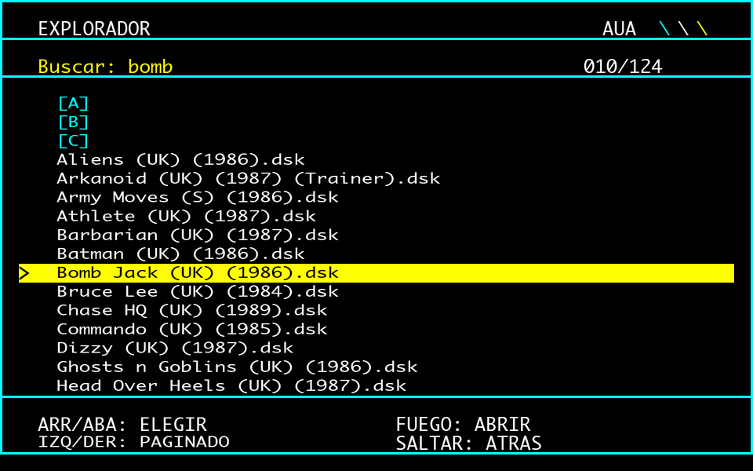

# Explorador Amstrad CPC

**Hecho para la Asociación de Usuarios de Amstrad (AUA).**

por Raul Jimenez · licencia MIT

Explorador de ficheros en ROM para el **M4 Board**. Navega la microSD con
joystick, muestra los nombres de fichero completos y **arranca los juegos
directamente** al pulsar fuego sobre una imagen `.dsk`.


*Representación de la interfaz: Mode 1, 40 columnas, cuatro tintas.*

## Por qué existe

M4FE, el front-end habitual del M4, muestra los nombres mutilados
—`ALIENS~2.DSK`— porque en Mode 1 solo le caben unos 13 caracteres por
línea: gasta un panel lateral fijo en la ayuda y le queda poco sitio.

Este mueve esa ayuda al pie de pantalla y dispone de **37 caracteres**,
casi el triple. Con el mismo hardware y las mismas limitaciones.

| | M4FE | Explorador |
|---|---|---|
| Modo | Mode 1, 40 col | Mode 1, 40 col |
| Nombre visible | ~13 caracteres | **~37 caracteres** |
| Ayuda | Panel lateral | Pie de pantalla |
| Arranque de juegos | Entrar y elegir | **Directo sobre el `.dsk`** |

## Qué hace

- **Nombres completos.** `Abu Simbel Profanation (S) (1986)` se lee
  entero, sin códigos ni abreviaturas.
- **Arranque directo.** Fuego sobre un `.dsk` entra en la imagen, busca
  el cargador y lo ejecuta. Sin pasos intermedios.
- **Joystick o teclado.** Cursores para elegir, izquierda y derecha para
  paginar, dos botones para entrar y volver.
- **Ordenación alfabética**, con las carpetas agrupadas arriba.
- **Buscador.** Pulsa `F`, escribe y salta a la primera coincidencia.
- **Sin parpadeo.** Doble búfer de pantalla: se dibuja en la página
  oculta y se conmuta el CRTC de un frame al siguiente.
- **Arranque automático conmutable.** Enciendes y aparece; sales con ESC
  y la máquina se reinicia sin él hasta que vuelvas a lanzarlo.



## Controles

| Tecla / mando | Acción |
|---|---|
| Arriba / abajo | Elegir |
| Izquierda / derecha | Página |
| FUEGO 1 / ENTER | Abrir carpeta o **ejecutar juego** |
| FUEGO 2 / DEL | Volver atrás |
| `F` | Buscar |
| ESC | Salir y reiniciar |

## Cómo arranca los juegos

Un programa en ejecución no puede hacer que BASIC ejecute nada por sí
mismo. La salida es la RSX con cadena por referencia. La ROM recibe `@a$`,
deja ahí el fichero elegido —con el directorio ya puesto— y devuelve el
control. **BASIC hace el `RUN`** en la línea siguiente:

```basic
10 a$=SPACE$(40)
20 |EXPLOR,@a$
30 IF a$<>"" THEN RUN a$
40 END
```

Dentro de un `.dsk` busca el cargador en tres pasadas: un `.BAS`, un
fichero con **extensión en blanco** (muy común en los discos de CPC), y
un `.BIN`. Si no encuentra ninguno, muestra el contenido para elegir a
mano. Los `.ROM` no se ejecutan: son imágenes para un slot de la placa.

## Instalación

1. Sube [`build/EXPLOR1.ROM`](build/EXPLOR1.ROM) a un slot libre del M4
   (del 8 al 15 en un 6128; en un 464 hace falta ROM baja modificada).
   Página **Roms** de la interfaz web, botón **Upload** del slot.
2. Reinicia el M4 y comprueba con `|M4HELP` que aparece en su slot.
3. Copia `bas/A.BAS` y `bas/E.BAS` a la raíz de la microSD.
4. En el CPC:

       RUN"A
       SAVE"AUTOEXEC.BAS
       RUN"E

El `SAVE` **debe hacerse en el CPC**: el arranque automático necesita el
fichero tokenizado y con cabecera AMSDOS, que es justo lo que produce el
`SAVE` del propio intérprete. Su manual también lo indica.

El slot donde viva la ROM del M4 se detecta solo, preguntando al firmware
dónde está el comando `|M4`. Funciona con el 6, el 7 o donde lo tengas.

## Arranque automático conmutable

El estado vive en el fichero `EXPON` de la tarjeta, que guarda un `1` o
un `0`. Todo en BASIC, la ROM no interviene.

| Situación | Efecto |
|---|---|
| Enciendes con `EXPON`=1 | Sale el explorador |
| Sales con ESC | `EXPON`=0 y la máquina **se reinicia** |
| Tras ese reinicio | BASIC limpio, sin explorador |
| `RUN"E` | Vuelve y reactiva el arranque |

Guarda un valor en lugar de existir o no a propósito: con la comprobación
por existencia, AMSDOS imprime su `not found` **antes** de que `ON ERROR`
pueda atraparlo y ensucia el arranque.

## Configuración

Arranca en `/ROMS` y no deja subir por encima. Para otra carpeta, cambia
la cadena `raiz` en [`src/v1/explorador.asm`](src/v1/explorador.asm); el
tope se ajusta solo, porque mide la ruta de partida en vez de usar un
número fijo. Si esa carpeta no existe, se queda en la raíz.

## Compilar

Necesitas **rasm**, de Roudoudou — ver [`tools/rasm.md`](tools/rasm.md).

```bash
./tools/rom.sh v1                    # ensambla build/EXPLOR1.ROM
M4=192.168.1.42 ./tools/rom.sh v1 12 # y ademas la sube al slot 12
```

## Limitaciones conocidas

- **El buscador solo mira en la carpeta actual**, no en toda la
  biblioteca.
- **Volver al explorador desde un juego es reiniciar.** Sin perder la
  partida haría falta una NMI.
- **La heurística del cargador fallará en algún disco.** Cuando pase, el
  listado interno es la red de seguridad.
- **130 entradas por directorio** como máximo.
- **Probado en un CPC 464** con ROM baja de 6128 y el M4 en el slot 6.
  Si lo usas en otra configuración, cuenta qué tal.

## Agradecimientos

A la **Asociación de Usuarios de Amstrad (AUA)**, para quien se ha hecho
este explorador. Por mantener viva una máquina de 1984 cuarenta años
después, por conservar el software y la documentación que de otro modo
se habrían perdido, y por seguir siendo el sitio donde preguntar cuando
algo no funciona.

Nada de esto tendría sentido sin una comunidad que siga encendiendo
estos ordenadores.

## Créditos

Explorador y documentación: **Raul Jimenez**, para la Asociación de
Usuarios de Amstrad (AUA).

El **M4 Board** es obra de **Duke** (spinpoint.org). **M4FE**, el
front-end que inspiró este proyecto, de **Abalore**. El ensamblador
**rasm** es de **Roudoudou**.
